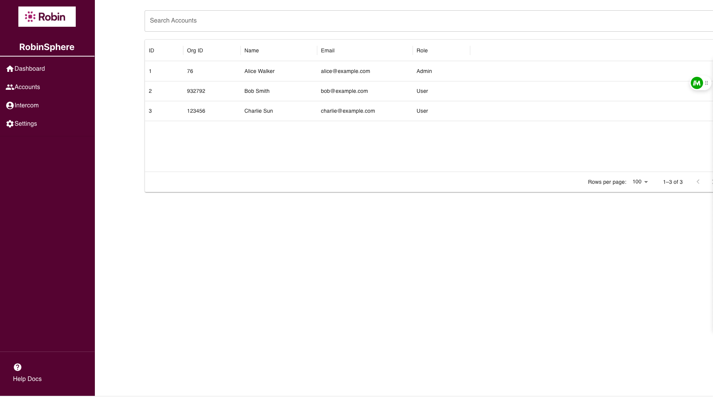
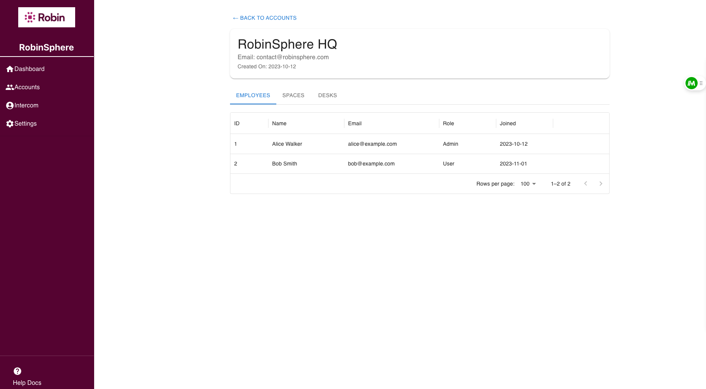

# RobinSphere - Dashboard for Support Team

This project was bootstrapped with [Create React App](https://github.com/facebook/create-react-app).

This web application is designed for the support team at Robin to manage and interact with organization accounts, employees, spaces, and desks within the platform. The goal is to provide an intuitive and modern interface for the team to efficiently manage multiple accounts, view detailed information, and perform administrative tasks.

## Key Features

- Account Overview:
    - Display key details about each account such as the organization name, email, role, and the account’s creation date.
- Tabbed Navigation for Hierarchical Data:
    - **Employees**: A list of all employees in an account, showing their name, email, role, and join date.
    - **Spaces**: A list of workspaces or areas within the organization that are available, showing their name and when they were created.

    - **Desks**: A list of desks or workstations, with information on their name and creation date.
- Searchable Data Tables:
    - The support team can easily search for accounts, employees, or spaces by name, email, or ID. The tables support efficient viewing of data and quick navigation to detailed views.
- Account Specific Details:
    - Clicking on any item (such as an employee or desk) will bring up further detailed information on that specific record.

## Available Scripts

In the project directory, you can run:

### `npm start`

Runs the app in the development mode.\
Open [http://localhost:3000](http://localhost:3000) to view it in your browser.

The page will reload when you make changes.\
You may also see any lint errors in the console.

### `npm test`

Launches the test runner in the interactive watch mode.\
See the section about [running tests](https://facebook.github.io/create-react-app/docs/running-tests) for more information.

### `npm run build`

Builds the app for production to the `build` folder.\
It correctly bundles React in production mode and optimizes the build for the best performance.

The build is minified and the filenames include the hashes.\
Your app is ready to be deployed!

See the section about [deployment](https://facebook.github.io/create-react-app/docs/deployment) for more information.

### `npm run eject`

**Note: this is a one-way operation. Once you `eject`, you can't go back!**

If you aren't satisfied with the build tool and configuration choices, you can `eject` at any time. This command will remove the single build dependency from your project.

Instead, it will copy all the configuration files and the transitive dependencies (webpack, Babel, ESLint, etc) right into your project so you have full control over them. All of the commands except `eject` will still work, but they will point to the copied scripts so you can tweak them. At this point you're on your own.

You don't have to ever use `eject`. The curated feature set is suitable for small and middle deployments, and you shouldn't feel obligated to use this feature. However we understand that this tool wouldn't be useful if you couldn't customize it when you are ready for it.

